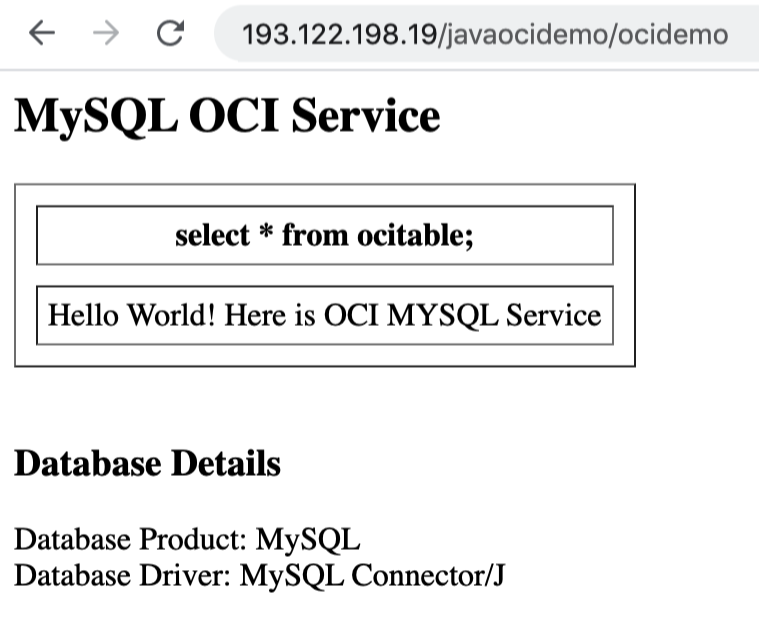
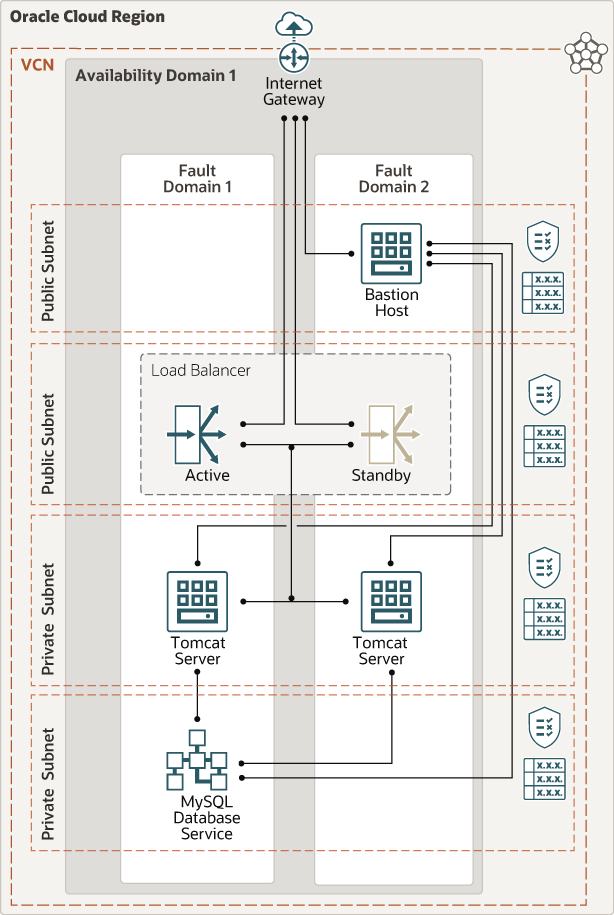

# oci-arch-tomcat-mds

Apache Tomcat® is an open source Java application server. It implements the Java Servlet, JavaServer Pages, Java Expression Language and Java WebSocket technologies.

MySQL Database Service is a fully-managed Oracle Cloud Infrastructure native service. It's developed, managed, and supported by the MySQL team at Oracle. Tasks such as backup and recovery, database and operating system patching, and so on are automated. You are responsible solely for managing your data, schema designs, and access policies.


## Prerequisites

- Permission to `manage` the following types of resources in your Oracle Cloud Infrastructure tenancy: `vcns`, `internet-gateways`, `route-tables`, `network-security-groups`, `subnets`, `mysql-family`, and `instances`.

- Quota to create the following resources: 1 VCN, 3 subnets, 1 Internet Gateway, 1 NAT Gateway, 2 route rules, 1 MDS instance, and 3 compute instances (bastion + 2 tomcat servers).

If you don't have the required permissions and quota, contact your tenancy administrator. See [Policy Reference](https://docs.cloud.oracle.com/en-us/iaas/Content/Identity/Reference/policyreference.htm), [Service Limits](https://docs.cloud.oracle.com/en-us/iaas/Content/General/Concepts/servicelimits.htm), [Compartment Quotas](https://docs.cloud.oracle.com/iaas/Content/General/Concepts/resourcequotas.htm).

## Deploy Using Oracle Resource Manager

1. Click [](https://console.us-phoenix-1.oraclecloud.com/resourcemanager/stacks/create?region=home&zipUrl=https://github.com/lfeldman/oci-arch-tomcat-mds/raw/main/resource-manager/oci-arch-tomcat-mds.zip)

    If you aren't already signed in, when prompted, enter the tenancy and user credentials.

2. Review and accept the terms and conditions.

3. Select the region where you want to deploy the stack.

4. Follow the on-screen prompts and instructions to create the stack.

5. After creating the stack, click **Terraform Actions**, and select **Plan**.

6. Wait for the job to be completed, and review the plan.

    To make any changes, return to the Stack Details page, click **Edit Stack**, and make the required changes. Then, run the **Plan** action again.

7. If no further changes are necessary, return to the Stack Details page, click **Terraform Actions**, and select **Apply**. 

## Deploy Using the Terraform CLI

### Clone the Module

1. Now, you'll want a local copy of this repo. You can make that with the commands:

    git clone https://github.com/oracle-quickstart/oci-arch-tomcat-mds.git
    cd oci-arch-tomcat-mds
    ls

2. Create a `terraform.tfvars` file, and specify the following variables:

```
# Authentication
tenancy_ocid         = "<tenancy_ocid>"
user_ocid            = "<user_ocid>"
fingerprint          = "<finger_print>"
private_key_path     = "<pem_private_key_path>"

# Region
region = "<oci_region>"

# Availablity Domain 
availablity_domain_name = "<availablity_domain_name>"

# Compartment
compartment_ocid = "<compartment_ocid>"

# MySQL DBSystem Admin Password 
mysql_db_system_admin_password = "<mysql_password>"

````

### Create the Resources
Run the following commands:

    terraform init
    terraform plan
    terraform apply


### Testing your deploymnet

After the deployment is finished, you can test that your Tomcat was deployed correctly and can access the tomcat demo application with MDS as database system. Pick up the value of the loadbalancer_public_url:

````
loadbalancer_public_url = http://193.122.198.19/javaocidemo/ocidemo

`````

Then copy it into Web browser. Here is the example of the succesfull outcome:



As the load balancer alternates between the 2 nodes, the session data should persist.

### Destroy the Deployment
When you no longer need the deployment, you can run this command to destroy the resources:

    terraform destroy

## Architecture Diagram




